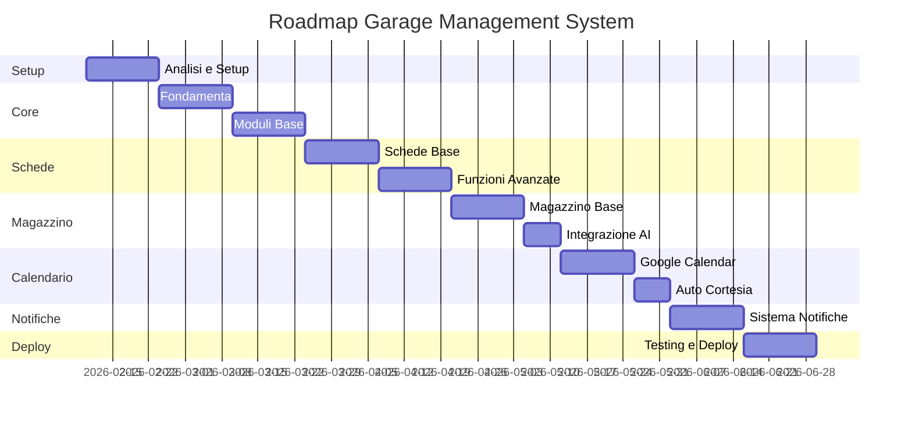

# 🗺️ ROADMAP PROGETTO - GARAGE MANAGEMENT SYSTEM

## 📋 EXECUTIVE SUMMARY

### **Obiettivo**
Sviluppare un sistema gestionale completo per officina meccanica e carrozzeria che ottimizzi i processi operativi, migliori la comunicazione con i clienti e fornisca strumenti di controllo avanzati per la direzione.

### **Durata Stimata**
- **Sviluppo completo**: 4-5 mesi
- **MVP (Minimum Viable Product)**: 2 mesi
- **Go-live progressivo**: Dal 3° mese

### **Budget Indicativo**
- **Sviluppo**: €25.000 - €35.000
- **Infrastruttura (anno)**: €2.400 - €3.600
- **Manutenzione (anno)**: €5.000 - €8.000

---

## 🎯 FASI DEL PROGETTO

### **FASE 0: SETUP E ANALISI (2 settimane)**

#### Settimana 1-2
- [ ] Analisi dettagliata requisiti con stakeholder
- [ ] Mappatura processi AS-IS
- [ ] Definizione processi TO-BE
- [ ] Setup ambiente sviluppo
- [ ] Configurazione repository e CI/CD
- [ ] Definizione standard di progetto

**Deliverable**: Documento requisiti finale, ambiente pronto

---

### **FASE 1: CORE SYSTEM (4 settimane)**

#### Settimana 3-4: Fondamenta
- [ ] Setup database PostgreSQL
- [ ] Implementazione autenticazione/autorizzazione
- [ ] Struttura base backend (Node.js/Express)
- [ ] Setup frontend React
- [ ] Sistema di routing e navigazione

#### Settimana 5-6: Moduli Base
- [ ] CRUD Clienti
- [ ] CRUD Veicoli
- [ ] CRUD Utenti e Ruoli
- [ ] Dashboard base per ogni ruolo
- [ ] Sistema di log e audit

**Deliverable**: Sistema base funzionante con gestione anagrafica

---

### **FASE 2: GESTIONE SCHEDE LAVORO (4 settimane)**

#### Settimana 7-8: Schede Base
- [ ] Creazione/modifica schede lavoro
- [ ] Workflow stati scheda
- [ ] Assegnazione attività a reparti
- [ ] Sistema di approvazione GM

#### Settimana 9-10: Funzionalità Avanzate
- [ ] Gestione attività multiple
- [ ] Timeline lavori
- [ ] Upload documenti/foto
- [ ] Calcolo preventivi automatico
- [ ] Stampa schede lavoro

**Deliverable**: Sistema completo gestione interventi

---

### **FASE 3: MAGAZZINO E RICAMBI (3 settimane)**

#### Settimana 11-12: Magazzino Base
- [ ] Anagrafica ricambi
- [ ] Gestione giacenze
- [ ] Movimenti magazzino
- [ ] Alert scorte minime

#### Settimana 13: Integrazione AI
- [ ] Integrazione API ricerca ricambi
- [ ] Comparazione prezzi fornitori
- [ ] Suggerimenti acquisto intelligenti
- [ ] Ordini automatici

**Deliverable**: Sistema magazzino con AI integrata

---

### **FASE 4: CALENDARIO E AUTO CORTESIA (3 settimane)**

#### Settimana 14-15: Calendario
- [ ] Integrazione Google Calendar
- [ ] Vista calendario multi-reparto
- [ ] Gestione appuntamenti
- [ ] Conflitti e disponibilità

#### Settimana 16: Auto Cortesia
- [ ] Gestione flotta auto
- [ ] Prenotazioni e assegnazioni
- [ ] Tracking utilizzo
- [ ] Documenti e checklist

**Deliverable**: Sistema scheduling completo

---

### **FASE 5: NOTIFICHE E COMUNICAZIONI (2 settimane)**

#### Settimana 17-18
- [ ] Sistema notifiche multi-canale
- [ ] Template email/SMS
- [ ] Automazioni scadenze
- [ ] WhatsApp Business API
- [ ] Preferenze cliente

**Deliverable**: Sistema comunicazione automatizzato

---

### **FASE 6: TESTING E DEPLOYMENT (2 settimane)**

#### Settimana 19-20
- [ ] Testing completo sistema
- [ ] Correzione bug
- [ ] Ottimizzazione performance
- [ ] Setup produzione
- [ ] Migrazione dati esistenti
- [ ] Formazione utenti

**Deliverable**: Sistema in produzione

---

## 📊 TIMELINE GANTT

---

## 🚀 STRATEGIA DI RILASCIO

### **MVP - Mese 2**
Funzionalità core disponibili:
- ✅ Gestione clienti e veicoli
- ✅ Schede lavoro base
- ✅ Dashboard ruoli

### **Release 1.0 - Mese 3**
Aggiunte:
- ✅ Workflow approvazione completo
- ✅ Gestione magazzino base
- ✅ Report base

### **Release 2.0 - Mese 4**
Aggiunte:
- ✅ Integrazione Google Calendar
- ✅ Auto cortesia
- ✅ Ricerca ricambi AI

### **Release 3.0 - Mese 5**
Sistema completo:
- ✅ Notifiche multi-canale
- ✅ Tutti i workflow automatizzati
- ✅ Analytics avanzate

---

## 💰 BREAKDOWN COSTI

### **Sviluppo**

| Fase | Ore Stimate | Costo (€50-70/h) |
|------|-------------|------------------|
| Setup e Analisi | 80h | €4.000-5.600 |
| Core System | 160h | €8.000-11.200 |
| Schede Lavoro | 160h | €8.000-11.200 |
| Magazzino + AI | 120h | €6.000-8.400 |
| Calendario | 120h | €6.000-8.400 |
| Notifiche | 80h | €4.000-5.600 |
| Testing/Deploy | 80h | €4.000-5.600 |
| **TOTALE** | **800h** | **€40.000-56.000** |

### **Infrastruttura Cloud (Mensile)**

| Servizio | Costo Base | Costo Pro |
|----------|------------|-----------|
| Hosting (AWS/Azure) | €100 | €200 |
| Database | €50 | €100 |
| Storage | €20 | €50 |
| Email/SMS | €30 | €80 |
| Backup | €20 | €40 |
| **TOTALE/mese** | **€220** | **€470** |

### **Servizi Esterni (Annuali)**

| Servizio | Costo |
|----------|-------|
| Google Workspace | €600 |
| WhatsApp Business | €300 |
| SSL Certificate | €100 |
| Dominio | €20 |
| **TOTALE/anno** | **€1.020** |

---

## 👥 TEAM RICHIESTO

### **Team Sviluppo**

| Ruolo | FTE | Competenze |
|-------|-----|------------|
| **Project Manager** | 0.5 | Gestione progetto, Agile |
| **Backend Developer** | 1.0 | Node.js, PostgreSQL, API |
| **Frontend Developer** | 1.0 | React, TypeScript, UI/UX |
| **DevOps Engineer** | 0.3 | Docker, CI/CD, Cloud |
| **QA Tester** | 0.5 | Testing, Automazione |

### **Consulenti**

| Ruolo | Ore | Quando |
|-------|-----|--------|
| **UX Designer** | 40h | Fase 0-1 |
| **Security Expert** | 20h | Fase 5-6 |
| **DBA** | 20h | Fase 0, 6 |

---

## 🎯 MILESTONE E PAGAMENTI

### **Struttura Pagamenti Consigliata**

| Milestone | Completamento | % Pagamento |
|-----------|---------------|-------------|
| Firma contratto | Inizio | 20% |
| Completamento Fase 1 | Core System | 20% |
| Completamento Fase 3 | Schede + Magazzino | 25% |
| Completamento Fase 5 | Sistema completo | 25% |
| Go-Live + 30gg | Produzione stabile | 10% |

---

## ⚠️ RISCHI E MITIGAZIONI

### **Rischi Tecnici**

| Rischio | Probabilità | Impatto | Mitigazione |
|---------|-------------|---------|-------------|
| Integrazione Google complessa | Media | Alto | Prototipo early, piano B |
| Performance con molti dati | Bassa | Alto | Design scalabile, caching |
| Sicurezza dati sensibili | Media | Critico | Audit security, GDPR compliance |

### **Rischi Organizzativi**

| Rischio | Probabilità | Impatto | Mitigazione |
|---------|-------------|---------|-------------|
| Resistenza al cambiamento | Alta | Medio | Formazione, coinvolgimento |
| Scope creep | Media | Alto | Change control rigido |
| Disponibilità stakeholder | Media | Medio | Planning anticipato |

---

## 📈 METRICHE DI SUCCESSO

### **KPI Tecnici**
- ✅ Uptime sistema > 99.5%
- ✅ Tempo risposta < 2 secondi
- ✅ Zero data loss
- ✅ Bug critici < 1/mese

### **KPI Business**
- ✅ Riduzione tempo gestione schede: -50%
- ✅ Aumento soddisfazione clienti: +30%
- ✅ Riduzione errori preventivi: -80%
- ✅ ROI positivo entro 12 mesi

### **KPI Adozione**
- ✅ 100% utenti attivi entro 1 mese
- ✅ 90% operazioni digitalizzate entro 3 mesi
- ✅ Feedback positivo > 80%

---

## 🔄 MANUTENZIONE POST-RILASCIO

### **Piano Manutenzione**

| Tipo | Frequenza | Ore/mese |
|------|-----------|----------|
| Bug fixing | Continuo | 20h |
| Aggiornamenti sicurezza | Mensile | 10h |
| Nuove feature minori | Trimestrale | 40h |
| Ottimizzazioni | Mensile | 10h |
| **TOTALE** | - | **80h/mese** |

### **SLA Proposto**
- **Incidenti critici**: Risoluzione < 4 ore
- **Incidenti maggiori**: Risoluzione < 24 ore
- **Incidenti minori**: Risoluzione < 72 ore
- **Richieste feature**: Valutazione < 1 settimana

---

## 📝 NOTE FINALI

### **Fattori Critici di Successo**
1. **Coinvolgimento attivo** della direzione
2. **Formazione adeguata** del personale
3. **Migrazione dati** accurata
4. **Testing approfondito** pre-rilascio
5. **Supporto continuo** post-rilascio

### **Quick Wins Consigliati**
- Dashboard GM disponibile da subito
- Notifiche clienti automatiche dal mese 2
- Report settimanali automatici
- App mobile per consultazione

### **Evoluzioni Future**
- App mobile nativa
- Integrazione contabilità
- Business Intelligence avanzata
- Chatbot assistenza clienti
- Integrazione IoT officina

---

**Documento creato:** 09/02/2026  
**Versione:** 1.0  
**Ultimo aggiornamento:** 09/02/2026

> 📞 **Contatti Progetto**  
> Project Manager: [da definire]  
> Technical Lead: [da definire]  
> Email: progetto-garage@[azienda].it