# 🔄 WORKFLOW OPERATIVI - GARAGE MANAGEMENT SYSTEM

## 📋 INDICE

1. [Workflow Principale - Gestione Scheda Lavoro](#workflow-principale)
2. [Workflow Approvazione](#workflow-approvazione)
3. [Workflow Gestione Magazzino](#workflow-magazzino)
4. [Workflow Auto Cortesia](#workflow-auto-cortesia)
5. [Workflow Pneumatici](#workflow-pneumatici)
6. [Workflow Notifiche](#workflow-notifiche)
7. [Diagrammi di Stato](#diagrammi-di-stato)

---

## 🎯 WORKFLOW PRINCIPALE - GESTIONE SCHEDA LAVORO

### **Flusso Completo**

```mermaid
flowchart TD
    A[Cliente arriva in officina] --> B{Cliente esistente?}
    B -->|No| C[Crea anagrafica cliente]
    B -->|Sì| D[Seleziona cliente]
    C --> E{Veicolo registrato?}
    D --> E
    E -->|No| F[Registra veicolo]
    E -->|Sì| G[Seleziona veicolo]
    F --> H[Crea scheda lavoro]
    G --> H
    
    H --> I[Valutazione danno]
    I --> J[Inserisci attività]
    J --> K{Tipo attività?}
    K -->|Meccanica| L[Assegna a CMM]
    K -->|Carrozzeria| M[Assegna a CBM]
    K -->|Mista| N[Assegna a CMM + CBM]
    
    L --> O[Verifica parti necessarie]
    M --> O
    N --> O
    
    O --> P{Parti disponibili?}
    P -->|Tutte| Q[Prenota parti]
    P -->|Parziali| R[Prenota disponibili]
    P -->|Nessuna| S[Tutte da ordinare]
    R --> T[Ordina mancanti]
    S --> T
    
    Q --> U{Auto cortesia?}
    T --> U
    U -->|Sì| V[Verifica disponibilità]
    U -->|No| W[Proponi appuntamento]
    V --> X{Auto disponibile?}
    X -->|Sì| Y[Assegna auto]
    X -->|No| Z[Proponi date alternative]
    Y --> W
    Z --> W
    
    W --> AA[Scheda in attesa approvazione]
    AA --> AB{GM approva?}
    AB -->|Sì| AC[Scheda approvata]
    AB -->|No| AD[Richiedi modifiche]
    AD --> I
    
    AC --> AE[Crea evento calendario]
    AE --> AF[Notifica CMM/CBM]
    AF --> AG[Inizio lavori]
    
    AG --> AH{Lavori completati?}
    AH -->|No| AI[Aggiorna stato attività]
    AI --> AG
    AH -->|Sì| AJ[Chiudi scheda]
    AJ --> AK[Notifica cliente]
    AK --> AL[Fine processo]
```



### **Dettaglio Fasi**

#### **1. ACCETTAZIONE (5-10 minuti)**
```
ATTORI: Receptionist, Cliente
AZIONI:
1. Verifica anagrafica cliente
2. Registra/aggiorna dati veicolo
3. Crea scheda lavoro preliminare
4. Stampa modulo accettazione

OUTPUT: Scheda lavoro in stato "bozza"
```

#### **2. VALUTAZIONE TECNICA (15-30 minuti)**
```
ATTORI: CMM/CBM, Cliente (opzionale)
AZIONI:
1. Ispezione veicolo
2. Identificazione danni/problemi
3. Stima ore lavoro
4. Lista parti necessarie
5. Valutazione costi

OUTPUT: Scheda lavoro completa con valutazione
```

#### **3. VERIFICA DISPONIBILITÀ (5 minuti)**
```
ATTORI: Sistema automatico
AZIONI:
1. Check parti in magazzino
2. Verifica calendario officina
3. Check auto cortesia disponibili
4. Calcolo tempi consegna

OUTPUT: Report disponibilità
```

#### **4. PROPOSTA CLIENTE (10 minuti)**
```
ATTORI: GM/Receptionist, Cliente
AZIONI:
1. Presenta preventivo
2. Propone date appuntamento
3. Offre auto cortesia (se richiesta)
4. Ottiene consenso cliente

OUTPUT: Scheda lavoro confermata
```

---

## ✅ WORKFLOW APPROVAZIONE

### **Processo di Approvazione GM**


### **Regole di Approvazione**

#### **Approvazione GM Obbligatoria**
**TUTTE le schede lavoro richiedono approvazione del Garage Manager (GM)**, indipendentemente da:
- Importo dell'intervento
- Tipo di cliente (nuovo o fidelizzato)
- Tipologia di lavoro
- Richiesta auto cortesia

**Il GM è l'unico attore autorizzato ad approvare le schede lavoro.**

#### **Criteri di Priorità**
```
URGENTE: Veicolo fermo, sicurezza compromessa
ALTA: Cliente business, flotta aziendale
MEDIA: Lavori programmati standard
BASSA: Manutenzione preventiva, estetica
```

---

## 📦 WORKFLOW GESTIONE MAGAZZINO

### **Ciclo Parti di Ricambio**

```mermaid
flowchart LR
    A[Richiesta parte] --> B{In magazzino?}
    B -->|Sì| C{Quantità sufficiente?}
    B -->|No| D[Ricerca fornitori AI]
    C -->|Sì| E[Prenota per scheda]
    C -->|No| F[Prenota disponibile]
    F --> G[Ordina mancante]
    D --> H[Confronta prezzi]
    H --> I[Seleziona fornitore]
    I --> G
    G --> J[Crea ordine acquisto]
    J --> K[Invia ordine]
    K --> L{Merce arrivata?}
    L -->|No| M[Sollecito fornitore]
    M --> L
    L -->|Sì| N[Registra arrivo]
    N --> O[Aggiorna giacenza]
    O --> P[Parte disponibile]
    E --> P
    P --> Q[Utilizzo in scheda]
    Q --> R[Scarico magazzino]
    R --> S[Aggiorna giacenza]
```



### **Stati Parti per Scheda Lavoro**

| Stato | Descrizione | Azioni Possibili |
|-------|-------------|------------------|
| `da_ordinare` | Parte non disponibile, da acquistare | Ordina, Annulla |
| `in_arrivo` | Ordine effettuato, in attesa consegna | Traccia, Sollecita |
| `disponibile` | Parte in magazzino, prenotata | Utilizza, Rilascia |
| `utilizzata` | Parte montata sul veicolo | Nessuna |
| `non_utilizzata` | Parte prenotata ma non usata | Rilascia in magazzino |

### **Alert Automatici Magazzino**

```
SCORTA MINIMA RAGGIUNTA
├── Notifica → Responsabile magazzino
├── Suggerimento → Quantità riordino
└── Azione → Proposta ordine automatico

PARTE CRITICA ESAURITA
├── Notifica → GM + Responsabile
├── Alert → Schede lavoro interessate
└── Azione → Ricerca urgente fornitori
```

---

## 🚗 WORKFLOW AUTO CORTESIA

### **Processo Assegnazione**


### **Regole Assegnazione Auto**

#### **Priorità Assegnazione**
1. **Durata intervento**: >2 giorni = priorità alta
2. **Tipo cliente**: Business/Fleet = priorità alta
3. **Distanza**: Cliente >20km = priorità media
4. **Storico**: Cliente fedele = priorità media

#### **Controlli Pre-Consegna**
- [ ] Documenti veicolo validi
- [ ] Assicurazione attiva
- [ ] Carburante >50%
- [ ] Pulizia interna/esterna
- [ ] Check danni esistenti
- [ ] Km attuali registrati

---

## 🛞 WORKFLOW PNEUMATICI

### **Ciclo Stagionale**


### **Processo Notifica e Cambio**

```
30 GIORNI PRIMA
├── Email automatica cliente
├── SMS reminder (se abilitato)
└── Flag in sistema per follow-up

15 GIORNI PRIMA
├── Seconda email
├── Chiamata telefonica
└── Proposta appuntamenti

7 GIORNI PRIMA
├── Ultimo reminder
├── WhatsApp (se abilitato)
└── Priorità scheduling

CAMBIO PNEUMATICI
├── Check-in pneumatici depositati
├── Ispezione usura
├── Cambio gomme
├── Bilanciatura
├── Aggiornamento posizione deposito
└── Prossima scadenza registrata
```

---

## 📬 WORKFLOW NOTIFICHE

### **Sistema Multi-Canale**

```mermaid
flowchart LR
    A[Evento trigger] --> B{Tipo evento}
    
    B -->|Appuntamento| C[Template appuntamento]
    B -->|Scadenza| D[Template scadenza]
    B -->|Completamento| E[Template completamento]
    B -->|Alert| F[Template alert]
    
    C --> G{Preferenze cliente}
    D --> G
    E --> G
    F --> G
    
    G -->|Email| H[Coda email]
    G -->|SMS| I[Coda SMS]
    G -->|WhatsApp| J[Coda WhatsApp]
    
    H --> K[Provider SendGrid]
    I --> L[Provider Twilio]
    J --> M[Provider WhatsApp Business]
    
    K --> N[Invio]
    L --> N
    M --> N
    
    N --> O{Esito}
    O -->|Successo| P[Log successo]
    O -->|Fallimento| Q[Retry logic]
    Q --> R{Max retry?}
    R -->|No| N
    R -->|Sì| S[Log fallimento]
```



### **Template Notifiche**

#### **Conferma Appuntamento**
```
Oggetto: Conferma appuntamento - {VEICOLO}

Gentile {NOME_CLIENTE},
confermiamo il suo appuntamento per:

Data: {DATA_APPUNTAMENTO}
Ora: {ORA_APPUNTAMENTO}
Veicolo: {MARCA} {MODELLO} - {TARGA}
Lavori: {TIPO_INTERVENTO}

{SE_AUTO_CORTESIA}
Le sarà fornita un'auto di cortesia per il periodo dei lavori.
{/SE_AUTO_CORTESIA}

Cordiali saluti,
{NOME_GARAGE}
```

#### **Alert Scadenza**
```
Oggetto: Scadenza {TIPO_SCADENZA} - {VEICOLO}

Gentile {NOME_CLIENTE},
le ricordiamo che il {DATA_SCADENZA} scade:

{DESCRIZIONE_SCADENZA}

Veicolo: {MARCA} {MODELLO} - {TARGA}

La invitiamo a contattarci per fissare un appuntamento:
Tel: {TELEFONO_GARAGE}
Email: {EMAIL_GARAGE}

Cordiali saluti,
{NOME_GARAGE}
```

---

## 📊 DIAGRAMMI DI STATO

### **Stati Scheda Lavoro**


### **Stati Attività**


### **Stati Auto Cortesia**


---

## 🔧 AUTOMAZIONI E TRIGGER

### **Trigger Automatici**

| Evento | Condizione | Azione |
|--------|------------|--------|
| Scheda approvata | Sempre | Crea evento Google Calendar |
| Parte sotto scorta | Quantità ≤ minima | Notifica + suggerimento ordine |
| Scadenza pneumatici | -30 giorni | Email cliente |
| Manutenzione scaduta | Data raggiunta | Alert + proposta appuntamento |
| Auto cortesia 3gg | Non restituita | SMS reminder cliente |
| Lavoro completato | Tutte attività chiuse | Email cliente + preparazione fattura |

### **Scheduler Giornaliero**

```
06:00 - Check scadenze pneumatici
07:00 - Check scadenze manutenzioni
08:00 - Invio notifiche programmate
09:00 - Report parti sotto scorta
14:00 - Reminder appuntamenti domani
17:00 - Check auto cortesia da ritirare
18:00 - Report giornaliero GM
```

---

## 📈 KPI E METRICHE

### **Metriche Operative**

| KPI | Formula | Target |
|-----|---------|--------|
| Tempo medio accettazione | Σ(tempo accettazione) / n° schede | < 15 min |
| Tasso approvazione GM | Schede approvate / totali | > 95% |
| Utilizzo auto cortesia | Giorni uso / giorni disponibili | > 80% |
| Accuracy previsioni | Consegne puntuali / totali | > 90% |
| Parti non disponibili | Ordini urgenti / totali | < 10% |

### **Dashboard Monitoring**

```
REAL-TIME DASHBOARD
├── Schede in attesa approvazione
├── Lavori in corso per reparto
├── Auto cortesia disponibili ora
├── Parti in arrivo oggi
├── Appuntamenti odierni
└── Alert e notifiche pending
```

---

**Documento creato:** 09/02/2026  
**Versione:** 1.0  
**Ultimo aggiornamento:** 09/02/2026